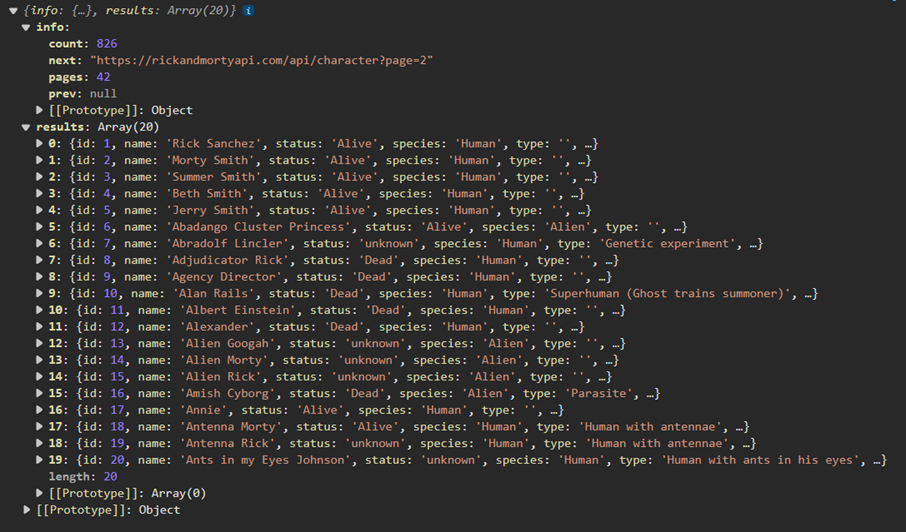

# Peticiones Fetch

El Fetch API es una tecnología moderna que permite realizar solicitudes HTTP de manera asincrónica desde el navegador. Es parte del estándar de HTML5 y proporciona una manera poderosa y flexible de interactuar con servidores web. A diferencia de XMLHttpRequest, que era la forma anterior de realizar solicitudes, fetch ofrece una forma más sencilla y potente de trabajar con promesas, facilitando la escritura de código asíncrono que es más fácil de leer y mantener.

Fetch API es una herramienta esencial para los desarrolladores web modernos, proporcionando una interfaz limpia y fácil de usar para realizar solicitudes HTTP. A lo largo de esta clase, aprenderemos a utilizar fetch en diferentes escenarios, manejar respuestas de diversos tipos, y gestionar errores de manera efectiva.

---
## IMPORTANTE: LEER PARA COMPRENDER RAPIDO

En la variable response esta el objeto Response.

// Objeto Response
Response {body: ReadableStream, bodyUsed: false, headers: Headers, ok: true, status: 200, ...}

### Resumido para aplicar
Pero internamente lo que hay en la variable response es un string '{"mensaje":"hola"}' y cuando le hago el response.json() y se resuelve, lo que obtengo es el objeto {mensaje:"hola"} **LE SACA LAS COMILLAS EXTERNAS!**. Ese objeto {mensaje:"hola"} se guarda en data y es un objeto Javascript. 


### Que fue lo que paso? 
Yendo un poco mas al detalle, response.json() internamente agarro del objeto Response ReadableStream que esta en body. Ahi saco el string '{"mensaje":"hola"}' y con la funcion JSON.parse(string) o mejor dicho JSON.parse('{"mensaje":"hola"}') **LE SACA LAS COMILLAS EXTERNAS!(Las comillas de las claves dejan de verse en consola porque para js es igual mensaje: que "mensaje":)** Y devuelve una promesa.
Esa promesa se resuelve luego del segundo .then() o con el segundo await en el otro metodo, y en data tenemos guardado el objeto Javascript {mensaje:"hola"}

---

# 📘 GUÍA BÁSICA DE FETCH Y PROMESAS EN JAVASCRIPT

Primero repasar el archivo [Apuntes para entender conceptos](ApuntesImportantes.md)

---

## 🟢 ¿Qué es `fetch`?

Es una función nativa de JavaScript para hacer peticiones HTTP. **Devuelve una promesa**.

```js
fetch('https://jsonplaceholder.typicode.com/posts/1')
```

Esto devuelve una promesa pendiente que se resuelve luego con un **objeto `Response`**.

---

## 🟡 Dos formas de usar `fetch`

### ✅ Opcion 1: con `.then()` y `.catch()` (forma clásica)

```js
fetch('https://jsonplaceholder.typicode.com/posts/1')
  .then(response => response.json())
  .then(data => console.log("Datos:", data))
  .catch(error => console.error("Error:", error));
```

El fetch retorna una promesa pendiente. El .then() es un mensaje que entienden las promesas.

- fetch() lanza la petición → la promesa queda pendiente.
- El primer .then() dice: “cuando tengas el resultado, pasamelo”.
- .then(response => response.json()) es un encadenamiento:
- response es el objeto Response que te da fetch cuando la promesa se resuelve.

Qué es response.json()?
Es un método del objeto Response que **devuelve una promesa**. Esa promesa se resuelve con los datos convertidos de texto plano JSON ejemplo: "{ "id": 1, "title": "Hola" }"; a un objeto JavaScript ejemplo: { id: 1, title: "Hola" }
Este metodo lee el cuerpo del Response, que normalmente es un string en formato JSON. (Es decir que lee el body: ReadableStram y ahi esta el JSON)

```javascript
// Objeto Response
Response {body: ReadableStream, bodyUsed: false, headers: Headers, ok: true, status: 200, ...}
```

- Lo interpreta usando JSON.parse() internamente, y lo convierte en un objeto Javascript.
- Finalmente response.json() devuelve una promesa que resuelve en un objeto JavaScript, no un string.


- El callback (response => response.json()) devuelve una nueva promesa (la de convertir el cuerpo en JSON) *La devuelve porque en el lenguaje JavaScript en las funciones flecha con una sola linea el return esta implicito*.
- Por eso, ese primer .then() también devuelve una promesa. Es decir, el primer .then() "hereda" la promesa que devuelve el callback.
- Cuando llega la respuesta del servidor, recién ahí la promesa se resuelve y se ejecuta el callback del primer .then() con el Response.
 Entonces, el siguiente .then() en la cadena espera automáticamente a que esa nueva promesa se resuelva.

🔁 En detalle

```javascript
fetch('...')
  .then(response => response.json()) // 🔄 devuelve una promesa
  .then(data => console.log(data));   // ✅ se ejecuta cuando esa promesa se resuelve
```

Es como si le dijeras: “No sigas hasta que tengas los datos procesados en JSON.” Esa es la magia del encadenamiento de promesas.

- ✅ Lo que recibe el segundo .then(data => ...): ese objeto JavaScript ya convertido.

Sin el segundo .then() no puedo acceder a los datos, solo son accesibles dentro del callback. Explicacion:
En el primer .then(response => response.json()), lo que tenés todavía no son los datos, sino una nueva promesa que va a resolverse con esos datos en formato objeto JavaScript.
📦 En otras palabras:
- El primer .then() recibe el Response, y llama a response.json(), que genera otra promesa.
- El segundo .then(data => ...) recibe el resultado final: ese objeto con los datos ya parseados y listos para usar.
💡 Así que sí, necesitás ese segundo .then() si querés trabajar directamente con los datos convertidos desde el JSON.


Si se imprime console.log(response) antes de llamar a .json(), vas a ver algo como:


```javascript
Response {body: ReadableStream, bodyUsed: false, headers: Headers, ok: true, status: 200, ...}
```

Si tratás de hacer console.log(response.json()) directamente, vas a ver algo curioso: no vas a obtener los datos, sino algo como esto 👇

```javascript

fetch('https://jsonplaceholder.typicode.com/posts/1')
  .then(response => {
    console.log(response.json());
  });
```


Resultado en consola:
Promise {<pending>}


🧠 ¿Por qué? Porque .json() es una función asíncrona que retorna una promesa, no los datos directamente.
Para ver el contenido real que devuelve esa promesa, necesitás encadenar otro .then() o usar await. Ejemplo correcto:

```javascript

fetch('https://jsonplaceholder.typicode.com/posts/1')
  .then(response => response.json())
  .then(data => {
    console.log("Datos reales:", data);
  });
```


Esto sí mostrará:

```javascript

Datos reales: {
  userId: 1,
  id: 1,
  title: "sunt aut facere repellat provident occaecati excepturi optio reprehenderit",
  body: "quia et suscipit\nsuscipit..."
}
```


💡 También podrías usar async/await para hacerlo más legible:
```javascript

async function obtenerDatos() {
  const response = await fetch('https://jsonplaceholder.typicode.com/posts/1');
  const data = await response.json();
  console.log("Datos con await:", data);
}

obtenerDatos();
```


### ✅ Opcion 2: con `async/await` y `try/catch` (forma moderna)

```js
async function obtenerDatos() {
  try {
    const response = await fetch('https://jsonplaceholder.typicode.com/posts/1');
    const data = await response.json();
    console.log("Datos:", data);
  } catch (error) {
    console.error("Error:", error);
  }
}

obtenerDatos();
```

> 💡 `await` solo se puede usar dentro de una función `async`.

---


# Comparacion con Promise

| Concepto           | Promise manual                 | Fetch                                |
| ------------------ | ------------------------------ | ------------------------------------ |
| Crea una promesa   | `new Promise(...)`             | `fetch('url')`                       |
| Resuelve o rechaza | `resolve(...)` / `reject(...)` | Se resuelve con la respuesta HTTP    |
| Usás `.then()`     | `.then(resultado => ...)`      | `.then(response => response.json())` |
| Usás `.catch()`    | `.catch(error => ...)`         | `.catch(error => ...)`               |


## 🔀 ¿Qué es `response`?

Es el valor que devuelve la promesa de `fetch`. No es directamente el JSON, sino un objeto especial de tipo `Response`.

### Propiedades útiles de `response`:

| Propiedad    | Tipo      | Descripción                                 |
| ------------ | --------- | ------------------------------------------- |
| `status`     | `number`  | Código HTTP (200, 404, 500...)              |
| `ok`         | `boolean` | `true` si el código está entre 200-299      |
| `statusText` | `string`  | Texto descriptivo del estado (`"OK"`, etc.) |
| `url`        | `string`  | La URL de la petición                       |
| `headers`    | `Headers` | Encabezados HTTP                            |
| `json()`     | `Promise` | Devuelve el contenido del cuerpo como JSON  |
| `text()`     | `Promise` | Devuelve el cuerpo como texto               |
| `blob()`     | `Promise` | Devuelve el cuerpo como archivo binario     |

---

## ⚠️ ¿Es obligatorio retornar `response.json()`?

**Sí.** Si no lo hacés, el siguiente `.then()` no recibe los datos.

### ❌ Incorrecto:

```js
fetch('https://jsonplaceholder.typicode.com/posts/1')
  .then(response => {
    response.json(); // NO se retorna
  })
  .then(data => {
    console.log("Datos:", data); // 🔴 data es undefined
  });
```

### ✅ Correcto:

```js
fetch('https://jsonplaceholder.typicode.com/posts/1')
  .then(response => {
    return response.json(); // ✅ retornás la promesa del JSON
  })
  .then(data => {
    console.log("Datos:", data); // ✅ recibís los datos reales
  });
```

✅ Dos formas válidas:

Forma corta (sin return, sin llaves):
```javascript
.then(response => response.json())
```
👉 Esta es la forma más usada. Como no hay llaves, el resultado de la línea se retorna automáticamente porque es una sola linea de codigo.

Forma larga (con llaves y return explícito):
```javascript
.then(response => {
  return response.json();
})
```
👉 Esta es útil si tenés que hacer más de una cosa dentro de la función.


## Diferencias entre .then().catch() y async await

🔍 En el caso de .then():

```javascript
fetch('...')
  .then(response => response.json())
  .then(data => { /* ... */ });
```


- La variable response vive únicamente dentro del bloque de ese primer .then().
- Es una variable local del callback, por lo tanto no es accesible fuera de ese .then().
  
⚙️ En el caso de async/await:

```javascript
async function obtenerDatos() {
  const response = await fetch('...');
  const data = await response.json();
  console.log(data);
}
```


- Acá response es una constante declarada en el ámbito completo de la función, por lo que podés usarla en cualquier línea dentro de obtenerDatos().
- Tenés más flexibilidad: podés verificar headers, status, hacer condiciones antes de response.json()… lo que quieras.
  
✅ En resumen:
- Con .then(), cada respuesta vive en su propio callback.
- Con await, podés guardar respuestas y manejarlas con más control y claridad.


---

## 🔄 ¿`response` es igual a `resolve`?

* **`resolve`** es lo que usás manualmente cuando creás una promesa personalizada:

```js
new Promise((resolve, reject) => {
  resolve("Hola");
});
```

* **`response`** es lo que `fetch` te da automáticamente **cuando la promesa se resuelve**.

| Promesa manual   | `fetch` automático               |
| ---------------- | -------------------------------- |
| `resolve(valor)` | `response` recibido en `.then()` |
| `reject(error)`  | `fetch()` falla con error de red |

> 🧠 *Pero ojo:* `fetch` **no rechaza** por errores HTTP (como 404). Solo por errores de red. Si querés capturar un 404:

```js
fetch('https://jsonplaceholder.typicode.com/post404')
  .then(response => {
    if (!response.ok) {
      throw new Error("Error HTTP: " + response.status);
    }
    return response.json();
  })
  .then(data => console.log(data))
  .catch(error => console.error("Error atrapado:", error));
```

---

## 🦪 ¿Qué se ve si hacés `console.log(response)`?

Vas a ver un objeto como este (ejemplo parcial):

```js
Response {
  body: ReadableStream,
  bodyUsed: false,
  headers: Headers,
  ok: true,
  redirected: false,
  status: 200,
  statusText: "OK",
  type: "cors",
  url: "https://jsonplaceholder.typicode.com/posts/1"
}
```

Para ver el contenido real:

```js
response.json().then(data => console.log(data));
```

Resultado:

```js
{
  userId: 1,
  id: 1,
  title: "sunt aut facere repellat provident occaecati...",
  body: "quia et suscipit\nsuscipit recusandae consequuntur..."
}
```

---

## 🧠 Conclusión general

| Concepto                 | Explicación                                                 |
| ------------------------ | ----------------------------------------------------------- |
| `fetch()`                | Devuelve una promesa con un objeto `Response`               |
| `.then(response => ...)` | Recibís el objeto `Response`, **no** los datos directamente |
| `response.json()`        | Devuelve otra promesa con los datos reales (como objeto JS) |
| `.then(data => ...)`     | Acá sí tenés el objeto JSON                                 |
| `async/await`            | Alternativa más clara para leer código                      |
| `return` en `.then()`    | Obligatorio para encadenar correctamente las promesas       |

---


# Peticiones APIs RESTful: Método GET

El método GET se utiliza para recuperar información del servidor. No modifica los datos en el servidor; sólo solicita y recibe datos. 
En Javascript, existen varias maneras de escribir código para solicitar la información al servidor a través del método GET. Veamos una de ellas con la api : https://rickandmortyapi.com/api/character

```javascript

const options = {method: 'GET', headers: {accept: 'application/json'}};

fetch('https://rickandmortyapi.com/api/character', options)
  .then(response => response.json())
  .then(response => console.log(response))
  .catch(err => console.error(err));
```

Se define un objeto options que especifica el método HTTP a utilizar (GET) y los encabezados de la solicitud. En este caso, el encabezado accept se establece en application/json, lo que indica que el cliente (nuestro código) espera que la respuesta esté en formato JSON.

Luego, se llama a la función fetch con la URL de la API de Rick and Morty y el objeto options como argumentos. fetch devuelve una promesa que se resuelve con el objeto response que representa la respuesta a la solicitud.

El método then se utiliza para especificar lo que debe hacerse una vez que se resuelve la promesa. En este caso, se llama al método json del objeto response, que también devuelve una promesa. Esta promesa se resuelve con el cuerpo de la respuesta parseado como JSON.

Finalmente, se utiliza otro then para manejar el JSON parseado. En este caso, simplemente se imprime en la consola. Si en algún punto del proceso ocurre un error (por ejemplo, si la solicitud falla), se captura con el método catch y se imprime en la consola.

## Analizando la respuesta recibida

La respuesta JSON es usualmente recibida como una cadena de texto. En JavaScript, necesitamos convertir esta cadena de texto en un objeto JavaScript para poder manipularlo más fácilmente. Esto se hace utilizando JSON.parse()

Una vez que tienes el objeto JavaScript, puedes acceder a sus propiedades y valores para obtener la información específica que necesitas. Dependiendo de la estructura del JSON, estos datos pueden estar en forma de objetos anidados o arrays.




## Validando los datos necesarios

```javascript

const pedirDatos = () => {
    fetch('https://rickandmortyapi.com/api/character', options)
      .then(response => response.json())
      .then(response => {
          response.results.forEach((personaje) => {
              // Imprimir en consola el nombre e imagen de cada personaje
              console.log(personaje.name, personaje.image, personaje.species);
            });
            
        })
        .catch(err => console.error(err));
    }
    
pedirDatos();
```


Dentro del método then, se accede a la propiedad results de la response. response.results es un array de objetos, donde cada objeto representa a un personaje.

El método forEach se utiliza para iterar sobre cada objeto (o personaje) en el array results. Para cada personaje, se imprime en la consola el valor de las propiedades name e image. Es decir, para cada personaje, se muestra su nombre y la ruta donde se encuentra su imagen.

De esta manera, en la consola veremos los datos que vamos a utilizar para construir el html de cada personaje. Existen herramientas como Postman o Insomnia que nos permiten consumir apis. Las veremos más adelante en este mismo curso.


Preparando el HTML

```html

<!DOCTYPE html>
<html lang="es">
<head>
    <meta charset="UTF-8">
    <meta name="viewport" content="width=device-width, initial-scale=1.0">
    <title>Rick And Morty Project</title>
</head>
<body>
    <header>
        <h1>Rick And Morty Project</h1>
    </header>
    <main id="personajes">
    </main>
    <footer>
        <p>Curso FullStack Node</p>
    </footer>
    <script src="index.js"></script>
</body>
</html>
```


Dentro de la estructura HTML definimos cual será el espacio para insertar los personajes.
En este caso identificaremos con el id=“personajes” a la etiqueta HTML que tomaremos desde Javascript para agregar los elementos de manera dinámica.


Luego agregamos el archivo de javascript dónde estamos desarrollando el método. En este caso, lo agregamos después porque el index.js ejecutará la función inmediatamente cuando sea llamado. 


Definiendo el HTML dinámico

```html
<article class="character">
    
    <h2>Rick Sanchez</h2>
    <div>
        <p>Human</p>
    </div>
</article>
```
Si pensamos en escribir código HTML para mostrar un personaje, utilizaríamos algo similar al código que se encuentra arriba. Pero necesitamos hacerlo dinámico, para que se complete cada vez con los datos obtenidos desde la api. 
Debemos generar el código en javascript que producirá la misma estructura html pero irá cambiando los valores de acuerdo a los datos del objeto que iteraremos.

```javascript

 const article = document.createElement('article');
        article.setAttribute('class', 'character');
        article.innerHTML = `
       
        <h2>${personaje.name}</h2>
        <div>
        <p>${personaje.species}</p>
        </div>`;

 container.appendChild(article);
```


## Incorporando el código en la iteración del objeto

```javascript

const options = {method: 'GET', headers: {accept: 'application/json'}};
const container = document.getElementById('personajes');
//Declaramos el contenedor anclándonos en el id=“personajes” definido en el HTML.
const pedirDatos = () => {
    fetch('https://rickandmortyapi.com/api/character', options)
      .then(response => response.json())
      .then(response => {
              // Incorporamos el código que se iterará por cada elemento del array generado con el json recibido. 
              response.results.map((personaje) => {
                  const article = document.createElement('article');
                  article.setAttribute('class', 'character');
                  article.innerHTML = `
                  
                  <h2>${personaje.name}</h2>
                  <div>
                  <p>${personaje.species}</p>
                  </div>`;
                  container.appendChild(article);
            });
            
        })
        .catch(err => console.error(err));
}
    
pedirDatos();
// Llamamos a la función para que se ejecute automáticamente cuando se cargue el archivo. También lo podemos hacer ante un evento determinado.

```


---

# DATOS SOBRE FETCH

¡Buena! El método `fetch()` puede recibir **hasta dos parámetros**, y no más.

---

## 🔍 Sintaxis general

```js
fetch(url, options);
```

### 1. `url` (obligatorio)
- Es un string con la dirección del recurso.
- Ejemplo: `"https://api.ejemplo.com/data"`

### 2. `options` (opcional)
- **Es un objeto** con configuración adicional:
  - Método (`GET`, `POST`, etc.)
  - Headers (`Authorization`, `Content-Type`, etc.)
  - Body (datos en formato JSON, texto, etc.)
  - Modo, credenciales, cache, etc.

---

## 📦 Ejemplo completo

```js
fetch("https://api.ejemplo.com/data", {
  method: "POST",
  headers: {
    "Content-Type": "application/json",
    Authorization: "Bearer token123"
  },
  body: JSON.stringify({ mensaje: "Hola mundo" })
});
```

- `fetch()` ignora cualquier parámetro extra más allá de esos dos.
- Si pasás un tercer parámetro por error, simplemente lo ignora y no lanza excepción.

---

